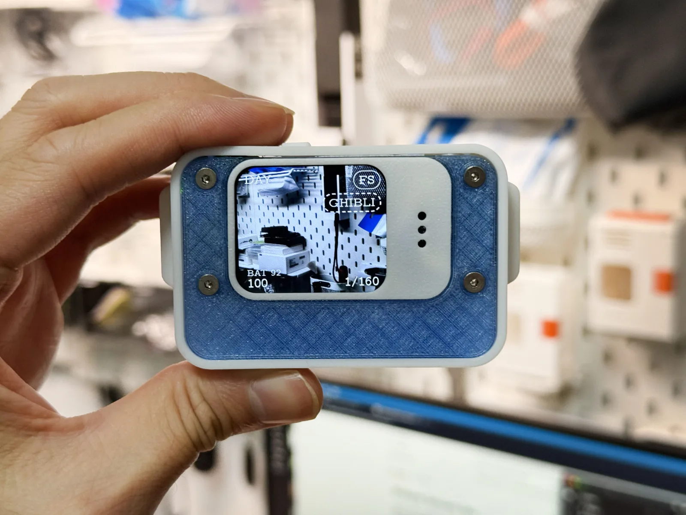

# Whisplay Optocam Zero

Whisplay Optocam Zero is an open-source, pocket-sized DIY digital camera for
the Raspberry Pi Zero family.

This repository was originally forked from
[Doruk Kumkumoğlu's Optocam Zero](https://github.com/dorukkumkumoglu/optocamzero)
and is now developed as an independent continuation. It preserves the original
3D-printable hardware design and Buildroot firmware while adding a Raspberry Pi
OS port for the Whisplay HAT, PiSugar 3 Air, and Raspberry Pi Camera Module 3.

Inspired by the Kodak Charmera and other toy cameras, the project emphasizes a
playful, intuitive shooting experience. The enclosure is fully printable and
the electronics use readily available, off-the-shelf components.

## Features
- GIF recording and playback.
- Custom filter maker for up to five presets in the hotspot interface.
- Very compact and easy to carry in your pocket.
- Intuitive and simple camera interface and controls.
- Uses autofocus camera module.
- 8 photo filters included.
- Fast image transfer through a hotspot interface optimized for mobile and desktop.
- Screen dimming when inactive to preserve battery.
- USB-C charging. Device can be used while charging.
- Interchangeable battery.
- Common, off-the-shelf electronic components.
- Fully 3D-printed enclosure apart from the fasteners.
- Printable TPU protective sleeve and lanyard.

 

## Specs
- Boots in approximately 5 seconds with the Buildroot image.
- Consistent 25–30 fps on-screen camera preview.
- 2592×2592 JPEG capture with background saving.
- 1.4-inch 240×240 LCD.
- 14500 Li-ion battery.
- 70–80 minutes of use per charge.
- Dimensions: 51×71×18mm (excluding camera and screen bump)
  
 

## Whisplay HAT + PiSugar 3 Air Port

The Whisplay port runs on Raspberry Pi OS and targets a different hardware
combination. It does **not** use the original 240×240 LCD, joystick,
shutter electronics, removable 14500 battery, or Buildroot image described in
the standard build guide.

### Hardware requirements

- Raspberry Pi Zero 2 W.
- Whisplay HAT with its 240×280 LCD, RGB LED, and single button.
- PiSugar 3 Air power board with its programmable button.
- Raspberry Pi Camera Module 3 (`imx708`) with autofocus.
- A compatible microSD card and the correct camera ribbon cable for Pi Zero.
- [3D-printable Whisplay + PiSugar 3 Air enclosure files](https://github.com/PiSugar/suit-cases/tree/main/pisugar3air-whisplay-optocam).

The normal Whisplay desktop image can run the camera through
`whisplay-daemon`. A dedicated installation without the daemon is also
supported; in that mode Optocam owns the Whisplay display and button directly.
See the [Whisplay installation guide](software/whisplay/README.md) for both
installation modes.

### Interaction changes

The Whisplay HAT has one camera button. On PiSugar 3 Air, the custom button
handles filter and gallery gestures, while the power button returns to the
Whisplay desktop in daemon mode. The original joystick controls are remapped as
follows:

| Context | Whisplay click | Whisplay double-click | Whisplay hold | PiSugar custom double-click | PiSugar custom hold, then release | PiSugar custom click | PiSugar power button |
| --- | --- | --- | --- | --- | --- | --- | --- |
| Camera preview | Take a photo or start GIF capture | Select next white balance | Cycle Photo/GIF/Moment¹ | Select next filter | Open on-device gallery | — (daemon) / toggle preview (standalone) | Home (daemon) |
| GIF recording | Cancel recording | — | — | — | — | — | Home (daemon) |
| Moment recording | Hold to record, release to save | — | — | — | — | — | Home (daemon) |
| Gallery | Return to camera preview | Show previous item | — | Show next item | Delete / confirm deletion | — | Home (daemon) |

¹ Moment mode is available on Whisplay hardware only when the detected ALSA
card is `whisplay-sound`. Recordings are capped at 10 seconds and discarded
when shorter than one second.

PiSugar custom-button long-press events are reported only after the button is released, so
the corresponding gallery action occurs on release. Optocam listens for
custom-button double-click and long-press events through the persistent TCP service
on `127.0.0.1:8423`; it does not inject commands into `button_shell` or change
the user's PiSugar button configuration.

Whisplay single-click is resolved after a short 350 ms double-click window so
that a double-click never takes an unintended photo. The daemon's Whisplay
quadruple-click exit gesture is disabled for Optocam. In daemon mode, the
PiSugar power button is the Home action.

Other differences from the original interface:

- The camera preview fills the complete 240×280 screen and is rotated 90°
  clockwise by default.
- Battery level is shown in smaller shadowed white text, for example `BAT 45`,
  above the ISO value in the lower-left preview HUD.
- The Whisplay RGB LED acknowledges shutter, save, filter, mode, gallery,
  recording, deletion, and error events.
- PHOTO and MOMENT captures play a short shutter sound through `whisplay-sound`.
- Filter, white-balance and gallery lists use next/previous gestures that wrap
  around, so every item remains reachable without a joystick.
- The original hotspot-mode and splash-screen gestures are not mapped. Captures
  are instead always available from the web gallery on port 80, for example
  `http://<raspberry-pi-address>/`.
- Moments carry a speaker badge in both galleries. Opening one plays its
  audio once; downloading or deleting it includes the paired JPG and WAV.

 

## Sample Photos

 
 
 
 

 

## Build the Camera

The [hardware](hardware/) directory contains the printable files, bill of
materials, CAD model, and step-by-step guide for the original Optocam Zero
build. The Whisplay HAT and PiSugar 3 Air version uses its own
[3D-printable enclosure](https://github.com/PiSugar/suit-cases/tree/main/pisugar3air-whisplay-optocam)
and the [Whisplay installation guide](software/whisplay/README.md).

 

## Hardware

See the [hardware](hardware/) folder for:

- [Bill of materials](hardware/BOM.md).
- [Build guide](hardware/optocamzero-build-guide.pdf) (PDF).
- [Bambu Studio project files](hardware/print-ready/) ready to print for transparent PETG or PETG / PETG-CF.
- [Individual .stls](hardware/stls/) for camera parts.
- [CAD file](hardware/cad/optocamzero_V1.0.step) for customization.

 

## Software

See the [software](software/) folder for: 

- Optocam Zero code and installation guide.
- Camera controls information.
